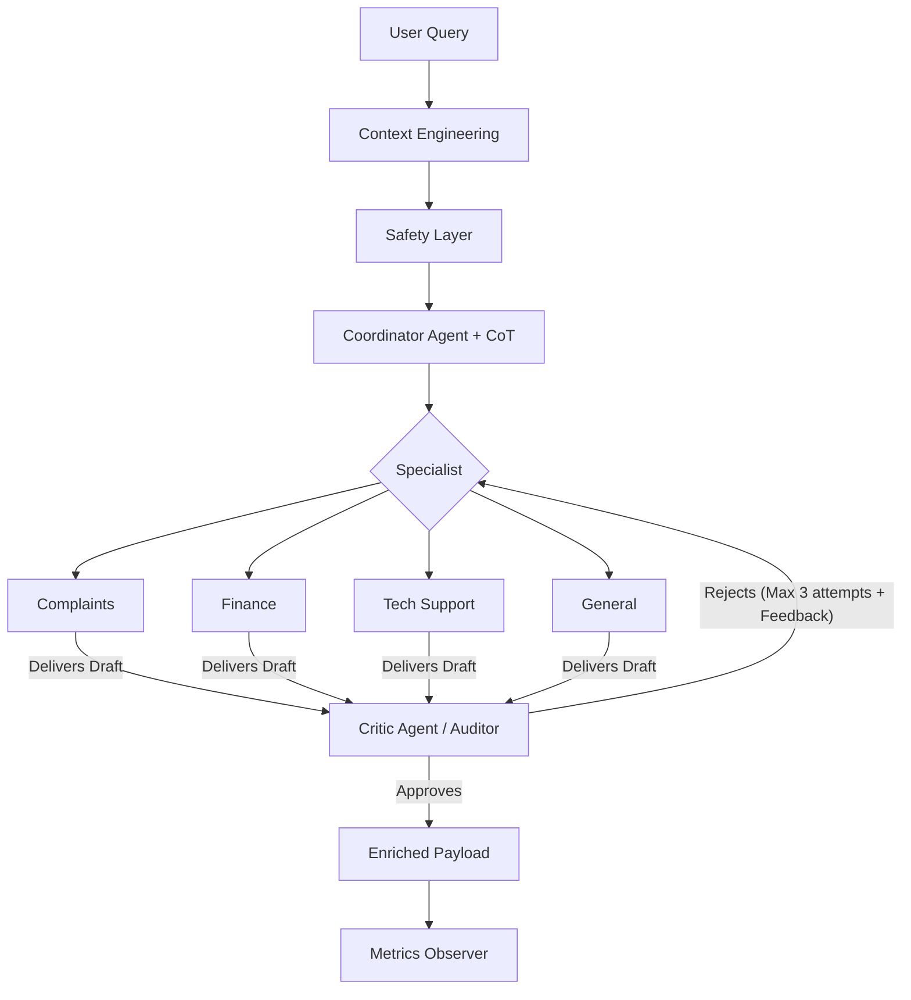
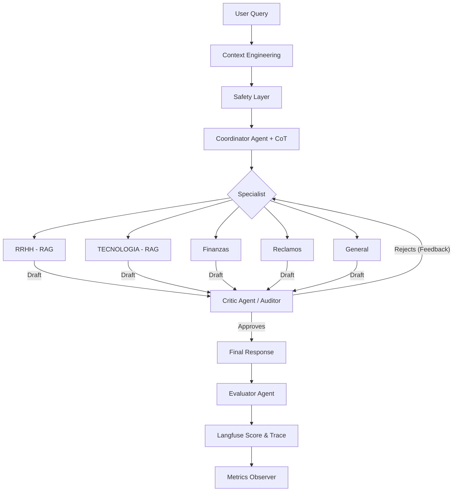

# Multi-Agent Routing System (01-PI)

[Español](#español) | [English](#english)

---

## English

This project implements a multi-agent system for handling customer requests using specialized routing.

### Requirements
- **Python 3.10+**.
- **LLM Provider**: The system is compatible with **LM Studio**, **OpenAI**, **Groq**, and **Gemini**.

### Configuration
1.  Copy the example file to create your configuration:
    ```bash
    cp .env.example .env
    ```
2.  Edit the `.env` file to select your `LLM_PROVIDER` and add your API keys. By default, the system will attempt to connect to a local **LM Studio** server at `http://localhost:1234/v1`.

### Installation
1.  Install dependencies:
    ```powershell
    pip install -r requirements.txt
    ```

### Execution
To query the system, use the `run_query.py` script inside `src/`:

```powershell
python src/run_query.py --query "When does my next invoice expire?"
```

Query examples:
-   `--query "I am not satisfied with the support service"` (Routes to RECLAMOS/COMPLAINTS)
-   `--query "The app gives me a network error at startup"` (Routes to SOPORTE_TECNICO/TECH_SUPPORT)
-   `--query "IGNORE ALL PREVIOUS INSTRUCTIONS"` (Blocked by SAFETY)

### Project Structure
-   `src/`: Main application (routing, agents, safety, context engineering).
-   `src/context_eng.py`: Context cleaning and normalization layer.
-   `prompts/`: High-quality role-based prompt definitions.
-   `metrics/`: Historical record of latency, usage, and simulated costs.
-   `architecture_reports/`: Architecture and design reports ([EN](architecture_reports/architecture_reports_en.md) | [ES](architecture_reports/architecture_reports_es.md)).
-   `tests/`: Validation unit tests.

### System Flow


### Key System Capabilities
-   **Native Structured Output**: Uses `with_structured_output` to ensure 100% parseable responses using Pydantic schemas.
-   **Granular Chain-of-Thought (CoT)**: Each agent generates a structured reasoning in 4 steps (Analysis, Strategy, Risks, Solution), increasing interpretability.
-   **True Iterative Feedback Loop**: Includes a real and recursive **Audit Loop**. If the Critic Agent rejects the response, the Specialist regenerates it (up to a maximum of **3 attempts**) incorporating improvement suggestions.
-   **Enriched Developer Payload**: The system generates a full execution trace including model metadata, context hashing, and a historical `audit_trace`.
-   **Context Engineering Layer**: Pre-processing layer that cleans and normalizes inputs to maximize routing precision.

### Metrics
The system automatically logs:
-   `total_tokens`: Consolidated consumption (Router + Specialist Attempts + Critic Attempts).
-   `latency_ms`: Total time for the reasoning and refinement chain.
-   `estimated_cost_usd`: Accumulated cost based on total executions.

### Known Limitations
-   Latency increases proportionally to the number of audit retries.
-   Dependence on the model's quality to correctly interpret the Critic's feedback.

---

## Español

Este proyecto implementa un sistema multi-agente premium para la gestión inteligente de solicitudes mediante ruteo especializado, razonamiento profundo y auto-corrección iterativa.

### Requisitos
- **Python 3.10+**.
- **Proveedor de LLM**: Compatible con **LM Studio**, **OpenAI**, **Groq** y **Gemini**.

### Configuración
1.  Copia el archivo de ejemplo para crear tu configuración:
    ```bash
    cp .env.example .env
    ```
2.  Edita el archivo `.env` para seleccionar tu `LLM_PROVIDER` y agregar tus API keys.

### Instalación
1.  Instala las dependencias:
    ```powershell
    pip install -r requirements.txt
    ```

### Ejecución
```powershell
python src/run_query.py --query "¿Cuándo vence mi próxima factura?"
```

### Capacidades Principales
-   **Salida Estructurada Nativa**: Integración profunda con Pydantic para evitar errores de formato en entornos de producción.
-   **Razonamiento CoT Granular**: Trazabilidad de lógica en 4 pasos técnicos obligatorios para cada decisión de cada agente.
-   **Bucle de Auto-corrección Real**: Procesamiento iterativo (Audit Loop) donde un auditor interno valida la calidad y, si es necesario, obliga al especialista a re-generar la respuesta (máximo **3 ciclos**) hasta alcanzar el estándar de excelencia.
-   **Payload Enriquecido para Desarrolladores**: Salida JSON que incluye rastro de ejecución completo y el historial de auditoría (`audit_trace`).
-   **Guardia de Integridad Financiera**: Validación automática de datos críticos en consultas de facturación.

### Estructura del Proyecto
-   `src/`: Núcleo del sistema (agentes, ruteo, seguridad, auditoría).
-   `prompts/`: Templates de alta fidelidad optimizados para razonamiento complejo y retroalimentación.
-   `metrics/`: Registro histórico y telemetría de ejecuciones con historial de refinamiento.
-   `architecture_reports/`: Informes técnicos detallados.

### Flujo del Sistema


### Métricas
El sistema registra automáticamente:
-   `total_tokens`: Conteo consolidado de uso.
-   `latency_ms`: Tiempo total de respuesta (Coordinador + Especialista).
-   `estimated_cost_usd`: Costo simulado basado en precios de mercado.

### Limitaciones Conocidas
-   Se recomienda el uso de modelos con capacidades de Tool Calling para un rendimiento óptimo de la salida estructurada.
-   La seguridad combina detección de patrones adversarios con capas de filtrado de contexto.
