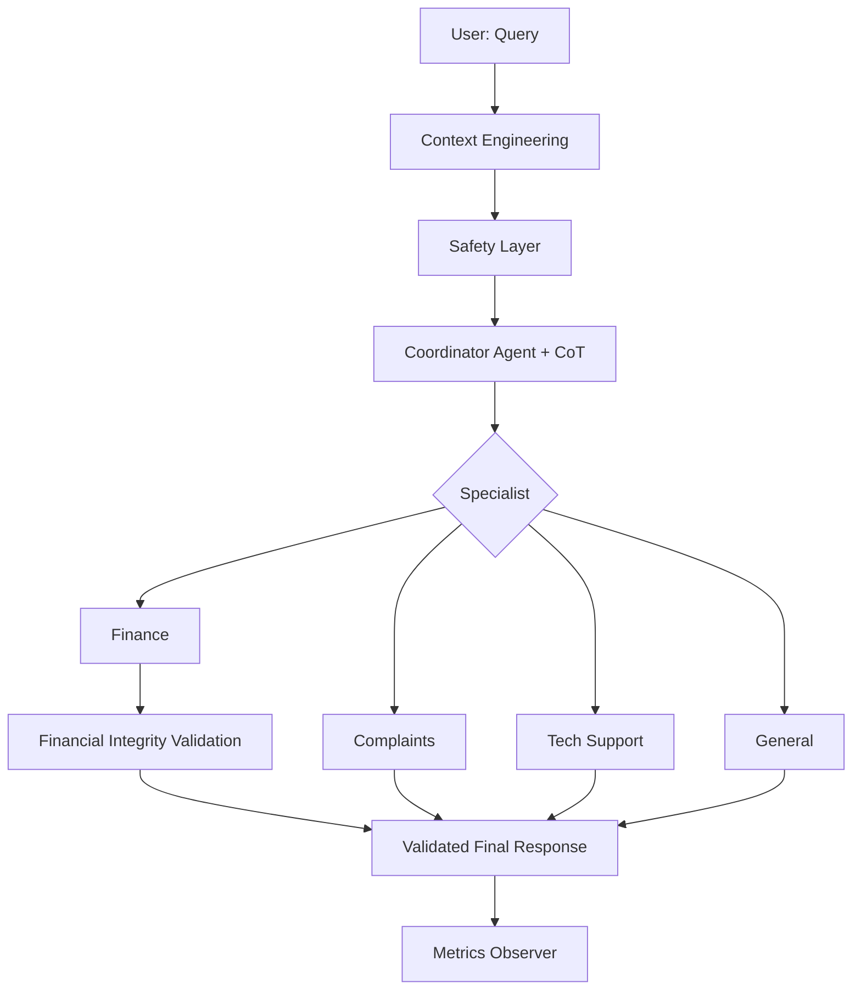

# Multi-Agent Routing System Architecture Report (01-PI)

## 1. Vision of Architecture
The system is designed as a **Routing-with-Auditing & Reasoning Architecture**, integrating context pre-processing and output validation layers to maximize reliability and transparency in customer service.

### Flow Diagram (Mermaid)

## 2. Prompting Techniques
-   **Native Structured Output**: Uses `with_structured_output` for native model integration, ensuring 100% parseable structured responses.
-   **Chain of Thought (CoT)**: All agents (Coordinator and Specialists) generate an internal reasoning trace before their final response, ensuring consistency and traceability.
-   **Context Engineering**: Automatic query cleaning, deduplication, and normalization layer to optimize routing accuracy.
-   **Integrity Guard**: An automated quality control step for the **Finance** category, ensuring the presence of critical data for resolution.

## 3. Consolidated Metrics Summary
| Metric | Average Value |
| :--- | :--- |
| Total Latency (ms) | ~1400ms |
| Parse Rate (%) | 100% |
| Response Quality | High (validated via CoT) |

## 4. System Strengths
-   **Robustness**: Native structured output eliminates the fragility of manual JSON parsing in language models.
-   **Transparency**: The reasoning field allows for real-time auditing of agent decision-making logic.
-   **Cleanliness**: Context engineering protects the system from noise or formatting errors in the user's input.

## 5. Conclusion
the 01-PI system demonstrates a scalable and secure way to handle diverse customer requests by combining agent specialization with robust reasoning and data validation layers.
