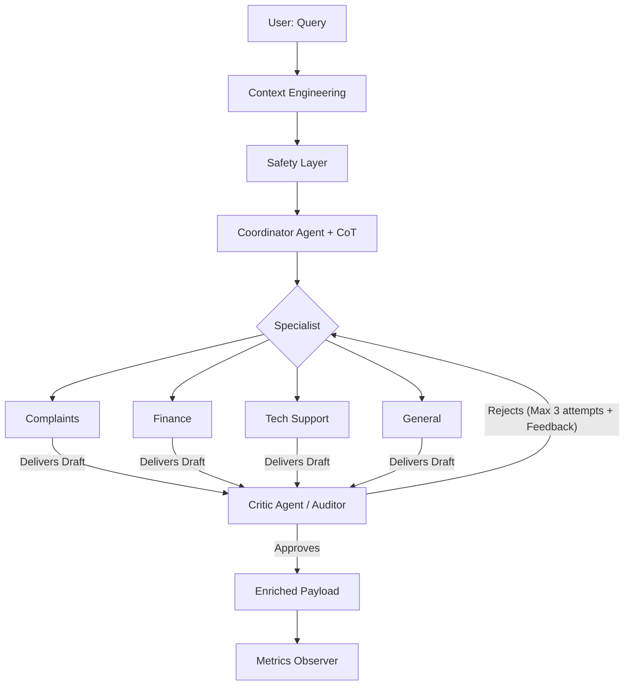

# Multi-Agent RAG System Architecture Report (01-PI)

## 1. Vision of Architecture
The system uses a **Retrieval-Augmented Routing with Autonomous Evaluation & Tracing Architecture**, designed to maximize precision through granular reasoning, external knowledge retrieval, and automated quality scoring.

### Flow Diagram (Mermaid)

## 2. Advanced Prompting Techniques
-   **Granular Chain-of-Thought (CoT)**: Mandates each agent to document its logic in 4 specific steps (Analysis, Strategy, Risks, Solution), allowing for an immediate technical audit.
-   **True Iterative Feedback Loop (Audit Loop)**: The system implements a real recursive loop. When the **Critic Agent** detects a failure (e.g., placeholders like `[Name]`, lack of empathy, or incomplete data), it sends the response back to the **Specialist** with precise improvement instructions. This process repeats for a maximum of **3 attempts** to ensure the final response is suitable for the user.
-   **Structured Output (Pydantic)**: Extensive use of models to ensure that `avoid` (what not to say) and `why_it_works` (technical justification) are mandatory and consistent fields.

## 3. Enriched Payload and Observability
To facilitate development and monitoring, the system generates an output that includes:
- **Context Hashing**: For traceability and integrity of the original input.
- **Audit Trace**: A complete history of each Critic iteration, showing what was rejected and why.
- **Attempts (`attempts`)**: A counter of the cycles performed to reach the final response.
- **Telemetry**: Detailed latency and token usage broken down by stage (Coordination, Resolution, Audit).

## 4. System Strengths
-   **Intelligent Iteration**: The system is capable of self-criticism and automatic correction before delivering the final response.
-   **Defense in Depth**: Combines pattern-based security with a semantic audit by the Critic Agent.
-   **Full Transparency**: Developers have access to the exact internal reasoning and the refinement history.

## 5. Conclusion
01-PI evolves from a simple router to a sophisticated multi-agent system that balances technical expertise with centralized and iterative quality control, similar to high-performance production architectures.
