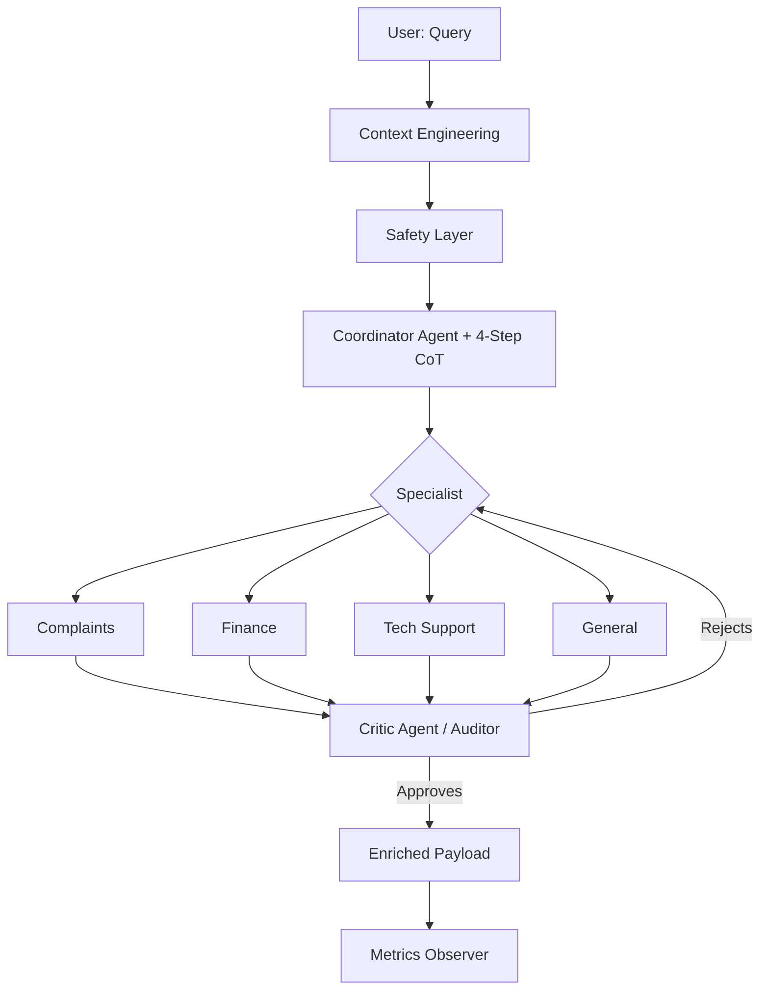

# Multi-Agent Routing System Architecture Report (01-PI)

## 1. Vision of Architecture
The system uses a **Routing-with-Active-Auditing & Reasoning Architecture (Feedback Loop)**, designed to maximize precision through granular reasoning and iterative response validation.

### Flow Diagram (Mermaid)

## 2. Advanced Prompting Techniques
-   **Granular Chain-of-Thought (CoT)**: Mandates each agent to document its logic in 4 specific steps (Signals, Strategy, Risks, Solution), allowing for an immediate technical audit.
-   **Feedback Loop**: The introduction of a **Critic Agent** acting as a reviewer ensures that the specialist's response meets company standards for tone, accuracy, and safety.
-   **Structured Output (Pydantic)**: Extensive use of models to ensure that `avoid` (what not to say) and `why_it_works` (technical justification) are mandatory fields.

## 3. Enriched Payload and Observability
To facilitate development and monitoring, the system generates an output that includes:
- **Context Hashing**: For traceability and integrity of the original input.
- **Audit Trace**: The Critic Agent's issue log and specific improvement suggestions.
- **Telemetry**: Detailed latency and token usage broken down by stage (Coordination, Resolution, Audit).

## 4. System Strengths
-   **Intelligent Iteration**: The system is self-critical before delivering the final response.
-   **Defense in Depth**: Combines pattern-based security with a semantic audit by the Critic Agent.
-   **Full Transparency**: Developers have access to the exact internal reasoning that led to every decision.

## 5. Conclusion
01-PI evolves from a simple router to a sophisticated multi-agent system that balances technical expertise with centralized quality control, similar to high-performance production architectures.
