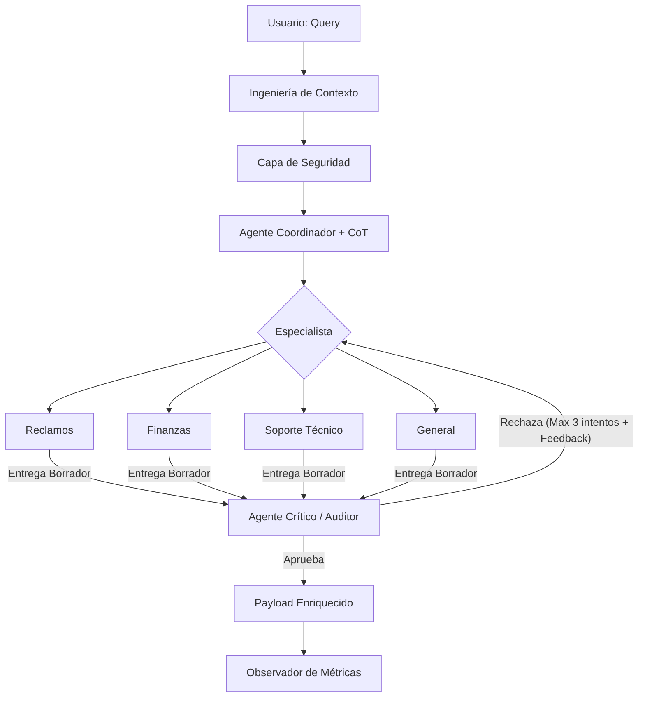

# Informe de Arquitectura del Sistema de Ruteo Multi-Agente (01-PI)

## 1. Visión de la Arquitectura
El sistema utiliza una **Arquitectura de Ruteo con Auditoría Activa (Feedback Loop)**, diseñada para maximizar la precisión mediante el razonamiento granular y la validación iterativa de respuestas.

### Diagrama de Flujo (Mermaid)

## 2. Técnicas de Prompting Avanzadas
-   **Granular Chain-of-Thought (CoT)**: Obliga a cada agente a documentar su lógica en 4 pasos específicos (Análisis, Estrategia, Riesgos, Solución), lo que permite una auditoría técnica inmediata.
-   **True Iterative Feedback Loop (Audit Loop)**: El sistema implementa un bucle recursivo real. Cuando el **Agente Crítico** detecta una falla (ej. placeholders como `[Nombre]`, falta de empatía o datos incompletos), devuelve la respuesta al **Especialista** con instrucciones precisas de mejora. Este proceso se repite hasta un máximo de **3 intentos** para asegurar que la respuesta final sea apta para el usuario.
-   **Structured Output (Pydantic)**: Uso extensivo de modelos para garantizar que el `avoid` (lo que no se debe decir) y `why_it_works` (justificación técnica) sean campos obligatorios y consistentes.

## 3. Payload Enriquecido y Observabilidad
Para facilitar el desarrollo y la supervisión, el sistema genera un output que incluye:
- **Hashing de Contexto**: Para trazabilidad e integridad de la entrada original.
- **Audit Trace**: Un historial completo de cada iteración del Crítico, mostrando qué se rechazó y por qué.
- **Intentos (`attempts`)**: Contador de ciclos realizados para llegar a la respuesta final.
- **Telemetría**: Latencia y consumo de tokens detallado por etapa (Coordination, Resolution, Audit).

## 4. Fortalezas del Sistema
-   **Iteración Inteligente**: El sistema es capaz de autocrítica y corrección automática antes de entregar la respuesta final.
-   **Defensa en Profundidad**: Combina seguridad de patrones con una auditoría semántica del Agente Crítico.
-   **Transparencia Total**: Los desarrolladores tienen acceso al razonamiento interno exacto y al historial de refinamiento.

## 5. Conclusión
01-PI evoluciona de un ruteador simple a un sistema de agentes sofisticado que equilibra la especialización técnica con un control de calidad centralizado e iterativo, similar a arquitecturas de producción de alto rendimiento.
