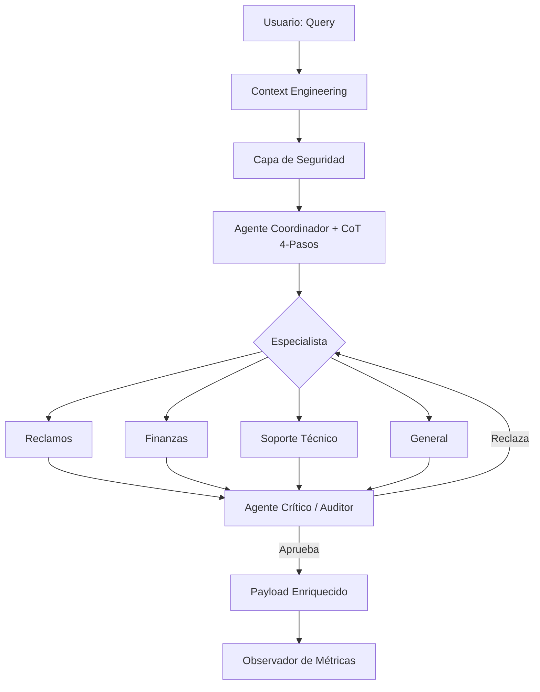

# Informe de Arquitectura del Sistema de Ruteo Multi-Agente (01-PI)

## 1. Visión de la Arquitectura
El sistema utiliza una **Arquitectura de Ruteo con Auditoría Activa (Feedback Loop)**, diseñada para maximizar la precisión mediante el razonamiento granular y la validación iterativa de respuestas.

### Diagrama de Flujo (Mermaid)

## 2. Técnicas de Prompting Avanzadas
-   **Granular Chain-of-Thought (CoT)**: Obliga a cada agente a documentar su lógica en 4 pasos específicos (Señales, Estrategia, Riesgos, Solución), lo que permite una auditoría técnica inmediata.
-   **Feedback Loop (Bucle de Retroalimentación)**: La introducción de un **Agente Crítico** que actúa como revisor garantiza que la respuesta del especialista cumpla con los estándares de tono, precisión y seguridad de la compañía.
-   **Structured Output (Pydantic)**: Uso extensivo de modelos para garantizar que el `avoid` (lo que no se debe decir) y `why_it_works` (justificación técnica) sean campos obligatorios.

## 3. Payload Enriquecido y Observabilidad
Para facilitar el desarrollo y la supervisión, el sistema genera un output que incluye:
- **Hashing de Contexto**: Para trazabilidad e integridad de la entrada original.
- **Auditoría Trace**: El rastro de issues y sugerencias del Agente Crítico.
- **Telemetría**: Latencia y consumo de tokens detallado por etapa (Coordination, Resolution, Audit).

## 4. Fortalezas del Sistema
-   **Iteración Inteligente**: El sistema es capaz de autocrítica antes de entregar la respuesta final.
-   **Defensa en Profundidad**: Combina seguridad de patrones con una auditoría semántica del Agente Crítico.
-   **Transparencia Total**: Los desarrolladores tienen acceso al razonamiento interno exacto que llevó a cada decisión.

## 5. Conclusión
01-PI evoluciona de un ruteador simple a un sistema de agentes sofisticado que equilibra la especialización técnica con un control de calidad centralizado, similar a arquitecturas de producción de alto rendimiento.
