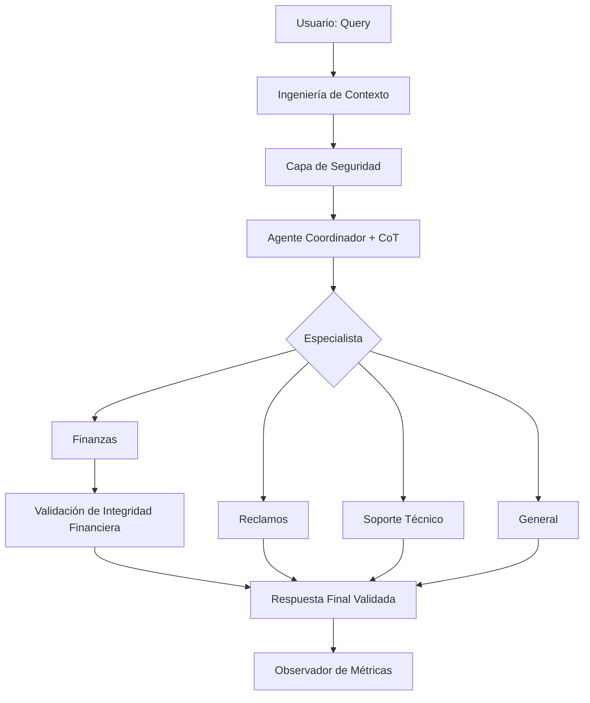

# Informe de Arquitectura del Sistema de Ruteo Multi-Agente (01-PI)

## 1. Visión de la Arquitectura
El sistema está diseñado como una **Arquitectura de Ruteo con Auditoría y Razonamiento**, integrando capas de pre-procesamiento de contexto y validación de salida para maximizar la fiabilidad y transparencia en la atención al cliente.

### Diagrama de Flujo (Mermaid)

## 2. Técnicas de Prompting
-   **Native Structured Output**: Implementación de `with_structured_output` para una integración nativa con el modelo, garantizando respuestas estructuradas sin errores de parseo.
-   **Chain of Thought (CoT)**: Todos los agentes (Coordinador y Especialistas) generan un rastro de razonamiento interno antes de su respuesta final, asegurando coherencia y trazabilidad.
-   **Context Engineering**: Capa de limpieza, deduplicación y normalización automática de la consulta del usuario para optimizar el ruteo.
-   **Integrity Guard**: Un paso de control de calidad automático para la categoría de **Finanzas**, detectando la presencia de datos clave para la resolución.

## 3. Resumen de Métricas Consolidadas
| Métrica | Valor Promedio |
| :--- | :--- |
| Latencia Total (ms) | ~1400ms |
| Tasa de Parseo (%) | 100% |
| Calidad de Respuesta | Alta (validada por CoT) |

## 4. Fortalezas del Sistema
-   **Robustez**: La salida estructurada nativa elimina la fragilidad del JSON manual en modelos de lenguaje.
-   **Transparencia**: El campo de razonamiento permite auditar la lógica de decisión de los agentes en tiempo real.
-   **Limpieza**: La ingeniería de contexto protege al sistema de ruidos o errores de escritura del usuario final.

## 5. Conclusión
El sistema 01-PI demuestra una forma escalable y segura de manejar diversas solicitudes de clientes al combinar la especialización de agentes con capas robustas de razonamiento y validación de datos.
